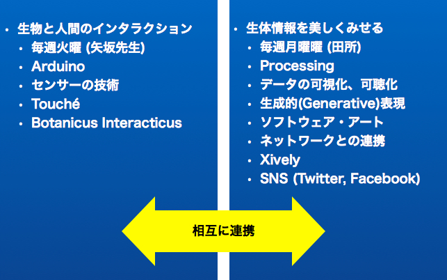

# 第1回: ガイダンス - Bio Media Art Workshopについて、Processingの復習

## このワークショップの目標

Bio Media Art Workshop (略称 BMAW) では、Processing および Arduino とそれらを組み合せて、センサーで環境の情報を計測したり、音や光、動きで 環境に働きかける方法を学び、植物と電子工作、プログラミングやネットワークを組み合せたバイオ・ガジェットを制作します。

作成したバイオ・ガジェットはTwitterやFacebookなどのSNSや、xivelyなどの計測データの共有サービスを利用して、積極的に世界中とシェアすることを目指します。

このワークショップでは、以下のツールやネットサービスを使用して作品を制作していきます。

### Arduino

センサーで計測した周囲の環境に関するデータを取得してMacなどのPCに送出します。デジタルとアナログの入出力ポートを備えたマイコンを搭載した専用の基板と、専用の開発環境から構成されています。

* [http://www.arduino.cc/](http://www.arduino.cc/)

### Processing

メディアアートやソフトウェアアート、ビジュアルデザインのためのプログラミング言語であり、統合開発環境。 MITメディアラボのAesthetics and Computation Group(美学と計算グループ?)に在籍していた、Casey ReasとBenjamin Fryにより2001開発されました。

* [http://processing.org/](http://processing.org/)

### Xively (旧Patchube, cosm)

センサーなどで計測したデータを、インターネットで共有するためのWebサービス。

* [https://xively.com/](https://xively.com/)

## ワークショップ全体の構成

### 月曜日:生体情報を美しくみせる(田所)

* Processing
* データの可視化、可聴化
* 生成的(Generative)表現
* ソフトウェア・アート
* ネットワークとの連携、Xively、SNS (Twitter, Facebook)


### 火曜日: 生物と人間のインタラクション(矢坂)

* Arduino 
* センサーの技術
* Touché
* Botanicus Interacticus (植物とのインタラクション)


## ワークショップで作成するシステムのイメージ

ワークショップでは、センサー、Arduino、Processingを組合せて作品を制作していきます。それぞれの役割とその接続イメージは下記の図のようになります。

## 制作する作品の例

センサーと植物をくみあわせた作品例です。Disney Researchに所属するIvan Poupyrev氏は、タッチセンサーに関する様々な研究を行っており、そこで開発された「Touché」というセンサーを用いて様々な興味深い作品を生みだしています。

Botanicus Interacticus – SIGGRAPH 2012 Exhibition, Disney Research by Ivan Poupyrev in collaboration with Philipp Schoessler, Jonas Loh/Studio NAND, and Munehiko Sato.

<iframe width="640" height="360" src="http://www.youtube.com/embed/_uTJiEYI1ik" frameborder="0" allowfullscreen></iframe>

ここで用いられているオリジナルに開発されたタッチセンサー「Touché」についての解説動画です。

<iframe width="640" height="360" src="http://www.youtube.com/embed/E4tYpXVTjxA" frameborder="0" allowfullscreen></iframe>

