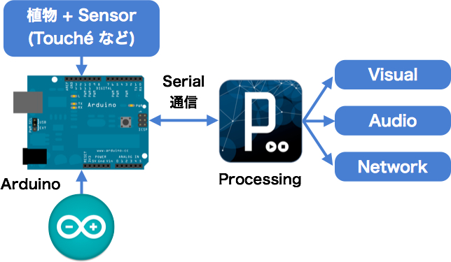
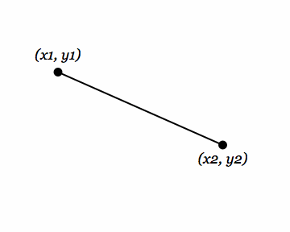
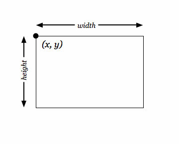
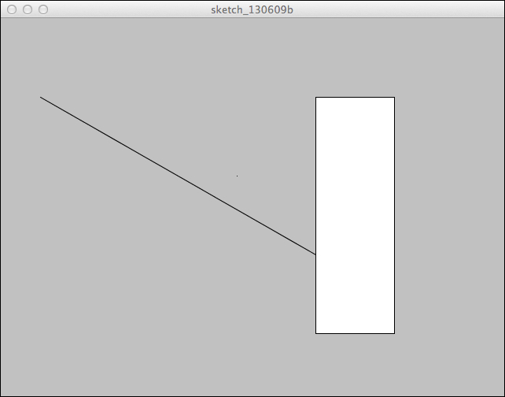
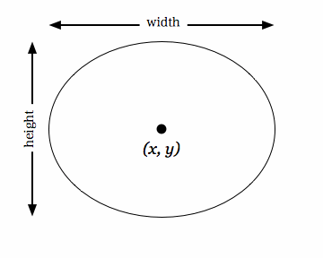
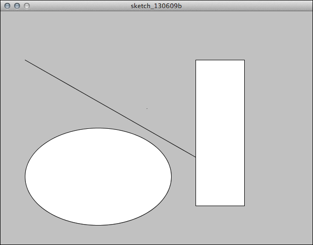

# 第1回: ガイダンス - Bio Media Art Workshopについて、Processingの復習

## このワークショップの目標

Bio Media Art Workshop (略称 BMAW) では、Processing および Arduino とそれらを組み合せて、センサーで環境の情報を計測したり、音や光、動きで 環境に働きかける方法を学び、植物と電子工作、プログラミングやネットワークを組み合せたバイオ・ガジェットを制作します。

作成したバイオ・ガジェットはTwitterやFacebookなどのSNSや、xivelyなどの計測データの共有サービスを利用して、積極的に世界中とシェアすることを目指します。

このワークショップでは、以下のツールやネットサービスを使用して作品を制作していきます。

### Arduino

センサーで計測した周囲の環境に関するデータを取得してMacなどのPCに送出します。デジタルとアナログの入出力ポートを備えたマイコンを搭載した専用の基板と、専用の開発環境から構成されています。

* [http://www.arduino.cc/](http://www.arduino.cc/)

### Processing

メディアアートやソフトウェアアート、ビジュアルデザインのためのプログラミング言語であり、統合開発環境。 MITメディアラボのAesthetics and Computation Group(美学と計算グループ?)に在籍していた、Casey ReasとBenjamin Fryにより2001開発されました。

* [http://processing.org/](http://processing.org/)

### Xively (旧Patchube, cosm)

センサーなどで計測したデータを、インターネットで共有するためのWebサービス。

* [https://xively.com/](https://xively.com/)


## ワークショップ全体の構成


### 月曜日:生体情報を美しくみせる(田所)

* Processing
* データの可視化、可聴化
* 生成的(Generative)表現
* ソフトウェア・アート
* ネットワークとの連携、Xively、SNS (Twitter, Facebook)


### 火曜日: 生物と人間のインタラクション(矢坂)

* Arduino 
* センサーの技術
* Touché
* Botanicus Interacticus (植物とのインタラクション)


### ワークショップで作成するシステムのイメージ

ワークショップでは、センサー、Arduino、Processingを組合せて作品を制作していきます。それぞれの役割とその接続イメージは下記の図のようになります。



### 制作する作品の例

センサーと植物をくみあわせた作品例です。Disney Researchに所属するIvan Poupyrev氏は、タッチセンサーに関する様々な研究を行っており、そこで開発された「Touché」というセンサーを用いて様々な興味深い作品を生みだしています。

Botanicus Interacticus – SIGGRAPH 2012 Exhibition, Disney Research by Ivan Poupyrev in collaboration with Philipp Schoessler, Jonas Loh/Studio NAND, and Munehiko Sato.

<!-- iframe width="640" height="360" src="http://www.youtube.com/embed/_uTJiEYI1ik" frameborder="0" allowfullscreen></iframe -->

ここで用いられているオリジナルに開発されたタッチセンサー「Touché」についての解説動画です。

<!-- iframe width="640" height="360" src="http://www.youtube.com/embed/E4tYpXVTjxA" frameborder="0" allowfullscreen></iframe -->


## Processingのスピード復習 

このワークショップでは、センサーで計測した情報の視覚化にはProcessingを使用します。そこで、まずワークショップ初回では、Processingでのプログラミングの概要について、一気におさらいしていきます。

### Processing参考書

Processingはとても素晴しいチュートリアルの書籍が多数出版されています。代表的な書籍をいくつか紹介します。

* [前川 峻志 (著), 田中 孝太郎 (著) 『Built with Processing[Ver. 1.x対応版] -デザイン/アートのためのプログラミング入門 』ビー・エヌ・エヌ新社、2010](http://www.amazon.co.jp/Built-Processing-1-x%E5%AF%BE%E5%BF%9C%E7%89%88-%E3%83%87%E3%82%B6%E3%82%A4%E3%83%B3-%E3%82%A2%E3%83%BC%E3%83%88%E3%81%AE%E3%81%9F%E3%82%81%E3%81%AE%E3%83%97%E3%83%AD%E3%82%B0%E3%83%A9%E3%83%9F%E3%83%B3%E3%82%B0%E5%85%A5%E9%96%80/dp/4861007070/ref=pd_sim_b_4)
* [Casey Reas (著), Ben Fry (著), 船田 巧 (翻訳) 『Processingをはじめよう』オライリージャパン、2011](http://www.amazon.co.jp/Processing%E3%82%92%E3%81%AF%E3%81%98%E3%82%81%E3%82%88%E3%81%86-Make-PROJECTS-Casey-Reas/dp/4873115159)
* [John Maeda, Casey Reas, Ben Fry, *Processing: A Programming Handbook for Visual Designers and Artists*, The MIT Press, 2007](http://www.amazon.co.jp/Processing-Programming-Handbook-Designers-Artists/dp/0262182629/ref=pd_sim_b_19)
* [Matt Pearson (著), 久保田 晃弘 (監修), 沖 啓介 (翻訳) 『ジェネラティブ・アート -Processingによる実践ガイド』ビー・エヌ・エヌ新社、2012](http://www.amazon.co.jp/%E3%82%B8%E3%82%A7%E3%83%8D%E3%83%A9%E3%83%86%E3%82%A3%E3%83%96%E3%83%BB%E3%82%A2%E3%83%BC%E3%83%88-Processing%E3%81%AB%E3%82%88%E3%82%8B%E5%AE%9F%E8%B7%B5%E3%82%AC%E3%82%A4%E3%83%89-Matt-Pearson/dp/4861008565/ref=pd_sim_fb_2)
* [Hartmut Bohnacker, Benedikt Gross, Julia Laub, Claudius Lazzeroni, *Generative Design: Visualize, Program, and Create with Processing*, Princeton Architectural Press, 2012](http://www.amazon.co.jp/Generative-Design-Visualize-Program-Processing/dp/1616890770/ref=pd_sim_b_10)
* [Daniel Shiffman, *The Nature of Code*, Amazon Services International, 2012](http://www.amazon.co.jp/dp/B00BPFT8D4/ref=cm_sw_r_fa_ask_hC-hF.0M2EFBJ)

### The Nature of Code


Daniel Shiffman氏の"The Nature of Code"は、Webサイトで全文公開されています(!!)、またビデオチュートリアルも公開されていてとてもわかりやすく、かつ高度なチュートリアルとなっています。基本からきちんとProcessingを学んでみたい方にお勧めです。

* [The Nature of Code オンライン版](http://natureofcode.com/book/)
* [ビデオチュートリアル (Daniel ShiffmanのVidemoアカウント)](https://vimeo.com/shiffman)

### Processing復習1: 座標、点を描く

コンピュータ画面上に図形を描いたりアニメーションをするためには、どこに図形を描くのか、つまり「場所」を指定する必要があります。プログラミングで場所を指定するには「座標」を使用します。２次元の平面では、原点からみた横の距離と縦の距離を記述することで、1点が定まります。Processingでは、ウィンドウの左上を原点(0,0)として、右方向の距離を「x座標」、下方向の位置を「y座標」と呼び、単位はピクセル(Pixel)で記述します。例えば（300, 200）という点は、画面表示領域の左上から300ピクセル右に、200ピクセル下に移動した場所になります。


では、Processingで(300, 200)の場所に点を描いてみましょう。

```c++
size(640,480); //640x480pixelの画面を生成
point(300,200); //300x200の場所に点を描く
```

ほとんどわかりませんが、点が描かれています!


### Processing復習2: 線と基本図形

次にこのプログラムに線を追加して描いてみましょう。Processingでは、線は2つの点を結ぶ図形と考えます。




```c++
size(640,480); //640x480pixelの画面を生成
point(300,200); //(300,200)の場所に点を描く
line(50,100,400,300); //(50,100)の点から(400,300)の点へ線を引く
```


さらに四角形を描いてみます。Processingでは、四角形を描く際にはまず左上の角の座標を指定して、幅と高さを指定します。



```c++
size(640,480); //640x480pixelの画面を生成
point(300,200); //(300,200)の場所に点を描く
line(50,100,400,300); //(50,100)の点から(400,300)の点へ線を引く
rect(400,100,100,300); //(400,100)の点から、幅100、高さ300の四角形を描く
```



最後に円(もしくは楕円)を描いてみましょう。円や楕円は中心位置の座標と、幅と高さを指定します。



```c++
size(640,480); //640x480pixelの画面を生成
point(300,200); //(300,200)の場所に点を描く
line(50,100,400,300); //(50,100)の点から(400,300)の点へ線を引く
rect(400,100,100,300); //(400,100)の点から、幅100、高さ300の四角形を描く
ellipse(200,340,300,200); //(200,340)の点を中心に、幅300、高さ200の楕円を描く
```




### Processing復習3: 色
### Processing復習4: アニメーション
### Processing復習5: 条件分岐
### Processing復習6: ベクタークラス
### Processing復習7: 繰り返しによる増殖


