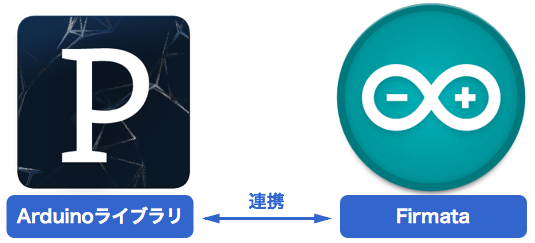
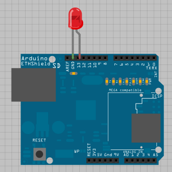
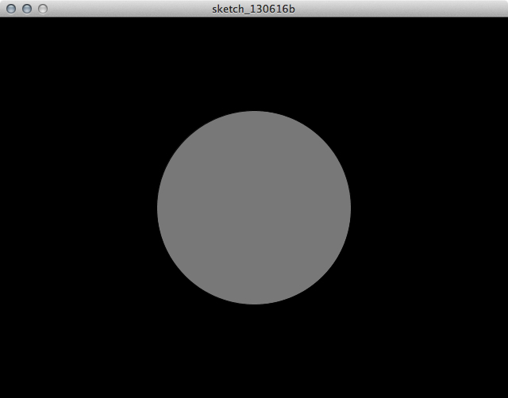

# 第2回: ProcessingとArduinoを接続する

今回は、いよいよProcessingとArduinoを連携する方法について実際にプログラミングしながら学んでいきます。ProcessingとArduinoを連携する方法は大きく分けて2つのやり方があります。

### 1. 既存のライブラリを使用する方法

Arduino側にFirmataライブラリ、Processing側にArduinoライブラリをインストールして、Processingから直接Arduinoの入出力を操作する方法。

### 2. シリアル通信を自作する方法

外部ライブラリは使用せず、ArduinoとProcessing双方で、シリアル入出力のプログラミングを行う方法。

今回はこの2つの方法の双方を紹介していきます。

## 連携方法 1: ArduinoライブラリとFirmataを使用する方法

**注意!!: Processing 2.0は、Arduinoライブラリ+Firmataの環境に対応していません。この方法を試す場合には、Processing 1.5.1を使用してください。インストールは下記のリンクから、v1.5.1を選択してダウンロードしてください。 **

* [https://processing.org/download/?processing](https://processing.org/download/?processing)

Arduino側にFirmataライブラリ、Processing側にArduinoライブラリをインストールして、Processingから直接Arduinoの入出力を操作する方法です。この方法を図にすると以下のようなイメージとなるでしょう。

### Arduino側の準備: Firmataライブラリをインストール

では、まずArduino側から準備を始めましょう。

ArduinoにはFirmataと呼ばれる、ArduinoなどのマイコンとPCとのコミュニケーションのための汎用のプロトコルを使用します。そのために、ArduinoにFirmataのためのプログラムをアップロードして使用します。今回はArduinoのサンプルの中に掲載されている「Standard Firmata」というプログラムを使用していきます。

Arduinoのメニューから以下のプログラムを開きます。

* File > Examples > Firmata > StandardFirmata

### Firmataの動作確認

Firmataの動作確認には、プロジェクトページから配布されているテストプログラムを使用します。

* [Main Page - Firmata](http://firmata.org/wiki/Main_Page)

このページの「Firmata Test Program」の項目にある

* For Mac OS-X: [http://www.pjrc.com/teensy/firmata_test/firmata_test.dmg](http://www.pjrc.com/teensy/firmata_test/firmata_test.dmg)

をダウンロードします。プログラムを展開し、FirmataをアップロードしたArduinoがUSBに接続されている状態で「firmata_test.app」を起動します。

プログラムのメニューバー「Port」メニューから接続しているポートを選択すると、下記のようなテスト画面になります。Pin 2 〜 Pin 21までの入出力をGUIで操作しながら試すことが可能です。

### Processing側の準備: Arduinoライブラリのインストール

次にProcessing側の準備をしましょう。ArduinoにFirmataライブラリをインストールしたのと同様に、Processing側にはArduinoをコントロールするためのライブラリをインストールします。Arduinoライブラリは、ProcessingからArduinoをコントロールするためにデザインされたライブラリで、Arduino側にはFirmataがインストールされていれば、特に追加でコーディングする必要はありません。

まず、Arduinoライブラリをダウンロードします。下記のリンクから「Processing Library: processing-arduino.zip」を選択してダウンロードしてください。

* [http://playground.arduino.cc/interfacing/processing](http://playground.arduino.cc/interfacing/processing)

ダウンロードした「processing-arduino.zip」を展開すると、「arduino」というフォルダが生成されます。このフォルダを、「書類」フォルダ内の「Processing」>「libraries」にコピーしてください。

### Processing + Firmataをつかってみる: シリアルポートの確認

まず、ProcessingからArduinoにインストールしたFirmataを操作するには、まず使用しているシリアルポートの環境を知る必要があります。下記のコードをProcessingに入力してください。

	import processing.serial.*;
	import cc.arduino.*;
	Arduino arduino;
	
	void setup() {
	  println(Arduino.list());
	}

すると、Processingの下部のコンソールに以下のようなメッセージが表示されるはずです。

	[0] "/dev/tty.Bluetooth-PDA-Sync"
	[1] "/dev/cu.Bluetooth-PDA-Sync"
	[2] "/dev/tty.Bluetooth-Modem"
	[3] "/dev/cu.Bluetooth-Modem"
	[4] "/dev/tty.usbserial-A900ceWs"
	[5] "/dev/cu.usbserial-A900ceWs"

この中から、「/dev/tty.usbserial…」もしくは「/dev/tty.usbmodem…」から始まる記述の先頭の番号(上記の例では4番)を憶えておきます。

### Processing + Firmataをつかってみる 1: Digital OUT - LEDを点灯

では、まず簡単なプログラムで動作を確認してみましょう。Processingの画面でマウスを押すとLEDが点灯するプログラムを作成してみましょう。Arduino側は、Digital Outの13番にLEDを接続しておきます。

	/*
	 * Arduino - Processingシリアル通信
	 * Firmataを使用したサンプル
	 * Processing側
	 */
	 
	import processing.serial.*;
	import cc.arduino.*;
	
	Arduino arduino;
	int ledPin = 13;
	color bgColor = color(0);
	
	void setup() {
	  size(400, 200);
	  arduino = new Arduino(this, Arduino.list()[4], 57600);
	  arduino.pinMode(ledPin, Arduino.OUTPUT);
	}
	
	void draw() {
	  background(bgColor);
	}
	
	void mousePressed() {
	  arduino.digitalWrite(ledPin, Arduino.HIGH);
	  bgColor = color(255,0,0);
	}
	
	void mouseReleased() {
	  arduino.digitalWrite(ledPin, Arduino.LOW);
	  bgColor = color(0);
	}

画面をクリックすると、LEDが点灯するはずです。

### Processing + Firmataをつかってみる 2: Analog In - センサーの情報を視覚化

では次に、アナログ入力を試してみましょう。この方法が、今後、様々なセンサーからの情報をProcessingで視覚化していく基本となります。

まずは、Arduino側のセンサーの準備をしましょう。まずはシンプルに2つの可変抵抗(もしくは光センサーなどの簡単なセンサー)を用いて実験してみましょう。例えば、下記の図は、2つの可変抵抗を接続した際の配線のサンプルとなります。

このセンサーの情報を視覚化するProcessingのコードを書いてみましょう。まずはシンプルにセンサーから取得した値の数値をモニターしてみましょう。

	/*
	 * Arduino - Processingシリアル通信
	 * Firmataを使用したサンプル
	 * Processing側
	 */
	 
	import processing.serial.*;
	import cc.arduino.*;
	Arduino arduino;
	int input0 = 0;
	int input1 = 1;
	
	void setup() {
	  size(400,200);
	  arduino = new Arduino(this, Arduino.list()[4], 57600);
	  arduino.pinMode(input0, Arduino.INPUT);
	  arduino.pinMode(input1, Arduino.INPUT);
	}
	
	void draw() {
	  background(0);
	  fill(255);
	  int analog0 = arduino.analogRead(input0);
	  int analog1 = arduino.analogRead(input1);
	  text("input0 = " + analog0, 10, 20);
	  text("input1 = " + analog1, 10, 40);
	}

このコードを実行すると、Analog0とAnalog1に入力したセンサーの生の値が、文字で表示されます。センサーの値は、ほぼ0〜1023の範囲となっているでしょう。

では、この数値を利用して、簡単な視覚化を行ってみましょう。下記のサンプルは、Analog Pin 0の値を円の直径に、Analog Pin 1の値を円のグレースケールの濃度に適用しています。

	/*
	 * Arduino - Processingシリアル通信
	 * Firmataを使用したサンプル
	 * Processing側
	 */
	 
	import processing.serial.*;
	import cc.arduino.*;
	Arduino arduino;
	int input0 = 0;
	int input1 = 1;
	
	void setup() {
	  size(640, 480);
	  arduino = new Arduino(this, Arduino.list()[4], 57600);
	  arduino.pinMode(input0, Arduino.INPUT);
	  arduino.pinMode(input1, Arduino.INPUT);
	}
	
	void draw() {
	  background(0);
	  fill(255);
	  int analog0 = arduino.analogRead(input0);
	  int analog1 = arduino.analogRead(input1);
	  text("input0 = " + analog0, 10, 20);
	  text("input1 = " + analog1, 10, 40);
	
	  float diameter = map(analog0, 0, 1024, 0, height);
	  float fillColor = map(analog1, 0, 1024, 0, 255);
	
	  fill(fillColor);
	  noStroke();
	  ellipse(width/2, height/2, diameter, diameter);
	}

## 連携方法 2: シリアル通信を自作する方法

次に、ArduinoとProcessingのもう一つの連携方法について試していきましょう。次に試す手法は、Arduino、Processing双方でシリアル通信のためのコードを自作して、通信の仕組み自体を自作していく方法です。Firmataを使用する方法に比べてきめ細かく効率的な通信が可能となります。また、Processing 2.0でも問題なく作動します。このワークショップで最終的に使用するToucheセンサーに関しても、このシリアル通信を自作する方法を用います。

今回のシリアル送受信には「ハンドシェイキング(handshaking)」という手法を使用してみます。ハンドシェイキングとは、2点間の通信路を確立した後、本格的に通信を行う前に事前のやり取りを自動的に行うことをいいます。実際の通信を行う前に、まず握手(ハンドシェイク)を行うイメージです。ハンドシェイキングした後は、通常の情報の転送を行います。

今回のArduinoとProcessingの通信では、まず実際のセンサーの値を送る前に、Processingからデータを送って欲しいというきっかけの合図を送る仕組みになっています。今回のサンプルでは任意の一文字(例えば'A'など)をArduinoに送ると、通信の開始のきっかけになります。ひとつのきっかけでArduinoからセンサーの数だけデータをコンマ区切りで送出し、最後に改行コードをつけます。Processingはこの一連のメッセージを受信して、受信が完了したら次のデータを要求するため再度任意の文字列(例えば'A'など)を送信します。

この通信の様子を図示すると以下のようになります。

先程のFirmataを使ったサンプルと同様にArduinoに読み込んだ2つのアナログセンサーの値を、Processingに送信して視覚化してみましょう。Arduino側の配線は、先程のFirmataのサンプルと同じ2つのアナログ入力(Analog Pin 0と1)です。

### arduino側プログラム

	/*
	 * Arduino - Processingシリアル通信
	 * Arduino側サンプル
	 */
	
	int sensors[2]; // センサーの値を格納する配列
	int inByte; // 受信するシリアル通信の文字列
	
	void setup(){
	  // 9600bpsでシリアルポートを開始
	  Serial.begin(9600);
	  // センサーの値と受信する文字列を初期化
	  sensors[0] = 0;
	  sensors[1] = 0;
	  inByte = 0;
	  // 通信を開始
	  establishContact();
	}
	
	void loop(){
	  // もしProcessingから何か文字を受けとったら
	  if (Serial.available() > 0) {
	    // 受信した文字列を読み込み
	    inByte = Serial.read();
	    // アナログセンサーの値を計測
	    sensors[0] = analogRead(A0);
	    sensors[1] = analogRead(A1);
	    // コンマ区切りでセンサーの値を送出
	    Serial.print(sensors[0]);
	    Serial.print(",");
	    Serial.println(sensors[1]);          
	  }
	}
	
	void establishContact() {
	  // Processingから何か文字が送られてくるのを待つ
	  while (Serial.available() <= 0) {
	    // 初期化用の文字列
	    Serial.println("0,0"); 
	    delay(300);
	  }
	}

	
### Processing側プログラム

	/*
	 * Arduino - Processingシリアル通信
	 * Processing側サンプル
	 */
	
	import processing.serial.*;
	Serial myPort; // シリアルポート
	
	float fillColor;
	float diameter;
	
	void setup() {
	  size(640, 480);
	  // ポート番号とスピードを指定してシリアルポートをオープン
	  myPort = new Serial(this, Serial.list()[4], 9600);
	  // 改行コード(\n)が受信されるまで、シリアルメッセージを受けつづける
	  myPort.bufferUntil('\n');
	}
	
	void draw() {
	  // 受信したセンサーの値で円を描画
	  background(0);
	  fill(fillColor);
	  ellipse(width/2, height/2, diameter, diameter);
	}
	
	void serialEvent(Serial myPort) { 
	  // シリアルバッファーを読込み
	  String myString = myPort.readStringUntil('\n');
	  // 空白文字など余計な情報を消去
	  myString = trim(myString);
	  // コンマ区切りで複数の情報を読み込む
	  int sensors[] = int(split(myString, ','));
	  // 読み込んだ情報の数だけ、配列に格納
	  if (sensors.length > 1) {
	    fillColor = map(sensors[0], 0, 1023, 0, 255);
	    diameter = map(sensors[1], 0, 1023, 0, height);
	  }
	  // 読込みが完了したら、次の情報を要求
	  myPort.write("A");
	}

プログラムを実行すると、センサーの値で大きさと明るさの変化する円が描かれます。

## 応用: センサーの値ビジュアライズ

では、この手法をつかって、既存のプログラムをセンサーの情報によって変化するように書き換えてみましょう。例えば、下記のプログラムは、Processingに付属しているサンプル「Examples > Demo > Performance > DynamicParticleImmediate」を改造して、2つのアナログ入力でパーティクルの場所を変化させています。元のサンプルでは、パーティクルの位置はマウスの位置に対応させている部分を、2つのアナログ入力の値を保持したPVectorクラスのインスタンス「pos」に書き換えることで実現しています。

	/*
	 * Arduino - Processingシリアル通信
	 * Processing側サンプル
	 */
	 
	import processing.serial.*;
	Serial myPort; // シリアルポート
	
	PVector pos = new PVector();
	
	PShape particles;
	PImage sprite;  
	
	int npartTotal = 10000;
	int npartPerFrame = 25;
	float speed = 1.0;
	float gravity = 0.05;
	float partSize = 20;
	
	int partLifetime;
	PVector velocities[];
	int lifetimes[];
	
	int fcount, lastm;
	float frate;
	int fint = 3;
	
	void setup() {
	  size(640, 480, P3D);
	  frameRate(120);
	
	  // ポート番号とスピードを指定してシリアルポートをオープン
	  myPort = new Serial(this, Serial.list()[4], 9600);
	  // 改行コード(\n)が受信されるまで、シリアルメッセージを受けつづける
	  myPort.bufferUntil('\n');
	
	  particles = createShape(PShape.GROUP);
	  sprite = loadImage("sprite.png");
	
	  for (int n = 0; n < npartTotal; n++) {
	    PShape part = createShape();
	    part.beginShape(QUAD);
	    part.noStroke();
	    part.texture(sprite);
	    part.normal(0, 0, 1);
	    part.vertex(-partSize/2, -partSize/2, 0, 0);
	    part.vertex(+partSize/2, -partSize/2, sprite.width, 0);
	    part.vertex(+partSize/2, +partSize/2, sprite.width, sprite.height);
	    part.vertex(-partSize/2, +partSize/2, 0, sprite.height);
	    part.endShape();    
	    particles.addChild(part);
	  }
	
	  partLifetime = npartTotal / npartPerFrame;
	  initVelocities();
	  initLifetimes(); 
	
	  // Writing to the depth buffer is disabled to avoid rendering
	  // artifacts due to the fact that the particles are semi-transparent
	  // but not z-sorted.
	  hint(DISABLE_DEPTH_MASK);
	} 
	
	void draw () {
	  background(0);
	
	  for (int n = 0; n < particles.getChildCount(); n++) {
	    PShape part = particles.getChild(n);
	
	    lifetimes[n]++;
	    if (lifetimes[n] == partLifetime) {
	      lifetimes[n] = 0;
	    }      
	
	    if (0 <= lifetimes[n]) {
	      float opacity = 1.0 - float(lifetimes[n]) / partLifetime;
	      part.setTint(color(255, opacity * 255));
	
	      if (lifetimes[n] == 0) {
	        // Re-spawn dead particle
	        part.resetMatrix();
	        // パーティクルの位置を、センサーからの情報で移動
	        part.translate(pos.x, pos.y);
	        float angle = random(0, TWO_PI);
	        float s = random(0.5 * speed, 0.5 * speed);
	        velocities[n].x = s * cos(angle);
	        velocities[n].y = s * sin(angle);
	      } 
	      else {
	        part.translate(velocities[n].x, velocities[n].y);
	        velocities[n].y += gravity;
	      }
	    } 
	    else {
	      part.setTint(color(0));
	    }
	  }
	
	  shape(particles);
	
	  fcount += 1;
	  int m = millis();
	  if (m - lastm > 1000 * fint) {
	    frate = float(fcount) / fint;
	    fcount = 0;
	    lastm = m;
	    println("fps: " + frate);
	  }
	}
	
	void initVelocities() {
	  velocities = new PVector[npartTotal];
	  for (int n = 0; n < velocities.length; n++) {
	    velocities[n] = new PVector();
	  }
	}
	
	void initLifetimes() {
	  // Initializing particles with negative lifetimes so they are added
	  // progressively into the screen during the first frames of the sketch   
	  lifetimes = new int[npartTotal];
	  int t = -1;
	  for (int n = 0; n < lifetimes.length; n++) {    
	    if (n % npartPerFrame == 0) {
	      t++;
	    }
	    lifetimes[n] = -t;
	  }
	} 
	
	void serialEvent(Serial myPort) { 
	  // シリアルバッファーを読込み
	  String myString = myPort.readStringUntil('\n');
	  // 空白文字など余計な情報を消去
	  myString = trim(myString);
	  // コンマ区切りで複数の情報を読み込む
	  int sensors[] = int(split(myString, ','));
	  // 読み込んだ情報の数だけ、配列に格納
	  if (sensors.length > 1) {
	    pos.x = map(sensors[0], 0, 1023, 0, width);
	    pos.y = map(sensors[1], 0, 1023, 0, height);
	  }
	  // 読込みが完了したら、次の情報を要求
	  myPort.write("A");
	}

