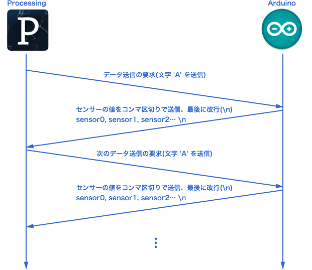
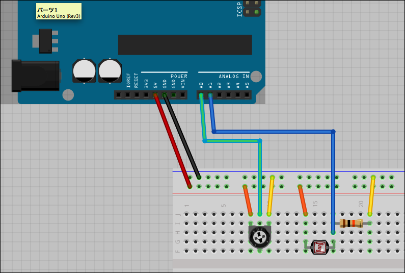
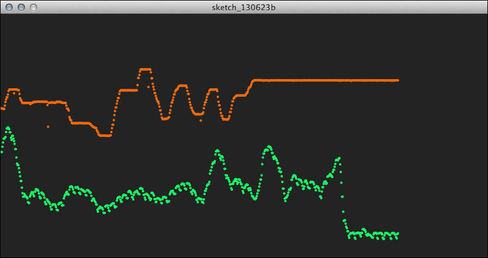
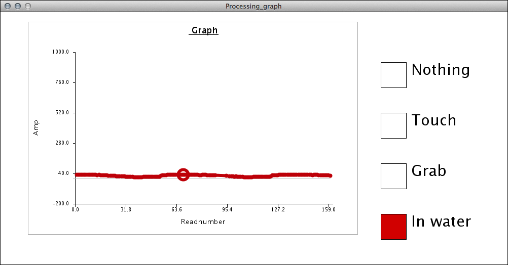

# 第2回: ProcessingとArduinoを接続する 2 - 時系列データの視覚化

## ProcessingとArduinoの連携: シリアル通信を自作する方法 (先週のつづき)

次に、ArduinoとProcessingのもう一つの連携方法について試していきましょう。次に試す手法は、Arduino、Processing双方でシリアル通信のためのコードを自作して、通信の仕組み自体を自作していく方法です。Firmataを使用する方法に比べてきめ細かく効率的な通信が可能となります。また、Processing 2.0でも問題なく作動します。このワークショップで最終的に使用するToucheセンサーに関しても、このシリアル通信を自作する方法を用います。

今回のシリアル送受信には「ハンドシェイキング(handshaking)」という手法を使用してみます。ハンドシェイキングとは、2点間の通信路を確立した後、本格的に通信を行う前に事前のやり取りを自動的に行うことをいいます。実際の通信を行う前に、まず握手(ハンドシェイク)を行うイメージです。ハンドシェイキングした後は、通常の情報の転送を行います。

今回のArduinoとProcessingの通信では、まず実際のセンサーの値を送る前に、Processingからデータを送って欲しいというきっかけの合図を送る仕組みになっています。今回のサンプルでは任意の一文字(例えば'A'など)をArduinoに送ると、通信の開始のきっかけになります。ひとつのきっかけでArduinoからセンサーの数だけデータをコンマ区切りで送出し、最後に改行コードをつけます。Processingはこの一連のメッセージを受信して、受信が完了したら次のデータを要求するため再度任意の文字列(例えば'A'など)を送信します。

この通信の様子を図示すると以下のようになります。

先程のFirmataを使ったサンプルと同様にArduinoに読み込んだ2つのアナログセンサーの値を、Processingに送信して視覚化してみましょう。Arduino側の配線は、先程のFirmataのサンプルと同じ2つのアナログ入力(Analog Pin 0と1)です。

### arduino側プログラム

	/*
	 * Arduino - Processingシリアル通信
	 * Arduino側サンプル
	 */
	
	int sensors[2]; // センサーの値を格納する配列
	int inByte; // 受信するシリアル通信の文字列
	
	void setup(){
	  // 9600bpsでシリアルポートを開始
	  Serial.begin(9600);
	  // センサーの値と受信する文字列を初期化
	  sensors[0] = 0;
	  sensors[1] = 0;
	  inByte = 0;
	  // 通信を開始
	  establishContact();
	}
	
	void loop(){
	  // もしProcessingから何か文字を受けとったら
	  if (Serial.available() > 0) {
	    // 受信した文字列を読み込み
	    inByte = Serial.read();
	    // アナログセンサーの値を計測
	    sensors[0] = analogRead(A0);
	    sensors[1] = analogRead(A1);
	    // コンマ区切りでセンサーの値を送出
	    Serial.print(sensors[0]);
	    Serial.print(",");
	    Serial.println(sensors[1]);          
	  }
	}
	
	void establishContact() {
	  // Processingから何か文字が送られてくるのを待つ
	  while (Serial.available() <= 0) {
	    // 初期化用の文字列
	    Serial.println("0,0"); 
	    delay(300);
	  }
	}

	
### Processing側プログラム

	/*
	 * Arduino - Processingシリアル通信
	 * Processing側サンプル
	 */
	
	import processing.serial.*;
	Serial myPort; // シリアルポート
	
	float fillColor;
	float diameter;
	
	void setup() {
	  size(640, 480);
	  // ポート番号とスピードを指定してシリアルポートをオープン
	  myPort = new Serial(this, Serial.list()[4], 9600);
	  // 改行コード(\n)が受信されるまで、シリアルメッセージを受けつづける
	  myPort.bufferUntil('\n');
	}
	
	void draw() {
	  // 受信したセンサーの値で円を描画
	  background(0);
	  fill(fillColor);
	  ellipse(width/2, height/2, diameter, diameter);
	}
	
	void serialEvent(Serial myPort) { 
	  // シリアルバッファーを読込み
	  String myString = myPort.readStringUntil('\n');
	  // 空白文字など余計な情報を消去
	  myString = trim(myString);
	  // コンマ区切りで複数の情報を読み込む
	  int sensors[] = int(split(myString, ','));
	  // 読み込んだ情報の数だけ、配列に格納
	  if (sensors.length > 1) {
	    fillColor = map(sensors[0], 0, 1023, 0, 255);
	    diameter = map(sensors[1], 0, 1023, 0, height);
	  }
	  // 読込みが完了したら、次の情報を要求
	  myPort.write("A");
	}

プログラムを実行すると、センサーの値で大きさと明るさの変化する円が描かれます。

## データの変化をグラフにプロット

では、次にもう少し実践的な視覚化にトライしてみましょう。アナログ入力に入ってくるセンサーの値は時間の経過とともに変化します。センサーの状態変化のパターンを視覚的にすぐに把握できるようにグラフで表示してみましょう。この手法は後でToucheでのジェスチャーの記録・判定の際にも関連してきます。

Arduinoのコードをもう少し改良して、センサーの数を簡単に変更できるようにしてみたいと思います。配列とくりかえしの部分を工夫することで実現しています。下記のようなコードに変更してみましょう。

冒頭の命令

	#define NUM 2 // センサーの数

の数値を変化させると使用できるセンサーの数が変化します。(この例では2つ)。入力はAnalog pin 0から順番に使用してください。

### arduino側プログラム

	/*
	 * Arduino - Processingシリアル通信
	 * Arduino側サンプル
	 * センサーの数、可変パージョン
	 */
	
	#define NUM 2 // センサーの数
	
	int sensors[NUM]; // センサーの値を格納する配列
	int inByte; // 受信するシリアル通信の文字列
	
	void setup(){
	  // 9600bpsでシリアルポートを開始
	  Serial.begin(9600);
	  // センサーの値と受信する文字列を初期化
	  for(int i = 0; i<NUM; i++){
	    sensors[i] = 0;
	  }
	  inByte = 0;
	  // 通信を開始
	  establishContact();
	}
	
	void loop(){
	  // もしProcessingから何か文字を受けとったら
	  if (Serial.available() > 0) {
	    // 受信した文字列を読み込み
	    inByte = Serial.read();
	    // アナログセンサーの値を計測
	    for(int i = 0; i<NUM; i++){
	      sensors[i] = analogRead(i);
	      // コンマ区切りでセンサーの値を送出
	      Serial.print(sensors[i]);
	      if(i < NUM - 1){
	        Serial.print(",");
	      }
	      else {
	        Serial.print('\n');
	      }
	    }
	  }
	}
	
	void establishContact() {
	  // Processingから何か文字が送られてくるのを待つ
	  while (Serial.available() <= 0) {
	    // 初期化用の文字列
	    Serial.println("0,0"); 
	    delay(300);
	  }
	}
	
### Processing側サンプル	

このArduinoからの複数のセンサーの値を受けとり、グラフにプロットするサンプルをみてみましょう。下記のサンプルはとてもシンプルに取得した値をもとに点を打っていくことで、グラフをプロットしています。

このプログラムもセンサーの数をすぐに変更できるように作成しています。プログラム冒頭の

	int NUM = 2; //センサーの数

の値を変更して、センサーの数を変更します。この数は先程作成したArduinoのプログラムで定義したセンサーの数と同じでなくてはなりません。

	/*
	 * Arduino - Processingシリアル通信
	 * センサーの値をグラフにプロット
	 * Processing側サンプル
	 */
	import processing.serial.*;
	
	int NUM = 2; //センサーの数
	Serial myPort; // シリアルポート
	
	int[] sensors = new int[NUM]; //センサーの値を格納する配列
	int cnt; //カウンター
	
	// グラフの線の色を格納
	color[] col = new color[6];
	
	void setup() {
	  //画面設定
	  size(800, 400);
	  frameRate(60);
	
	  // シリアルポートのリスト取得
	  println(Serial.list());
	  // ポート番号とスピードを指定してシリアルポートをオープン
	  myPort = new Serial(this, Serial.list()[4], 9600);
	  // 改行コード(\n)が受信されるまで、シリアルメッセージを受けつづける
	  myPort.bufferUntil('\n');
	
	  //グラフ初期化
	  initGraph();
	}
	
	void draw() {
	  // センサーの数だけ、グラフをプロット  
	  for (int i = 0; i < NUM; i++) {
	    fill(col[i]);
	    float tx = map(cnt, 0, width, 0, width);
	    float ty = map(sensors[i], 0, 1023, height, 0);
	    ellipse(tx, ty, 4, 4);
	  }
	  // 画面の右端まで描画したら再初期化
	  if (cnt > width) {
	    initGraph();
	  }
	  //カウンタアップ
	  cnt++;
	}
	
	//グラフの初期化
	void initGraph() {
	  background(47);
	  noStroke();
	  cnt = 0;
	  // グラフ描画の線の色を定義
	  col[0] = color(255, 127, 31);
	  col[1] = color(31, 255, 127);
	  col[2] = color(127, 31, 255);
	  col[3] = color(31, 127, 255);
	  col[4] = color(127, 255, 31);
	  col[5] = color(127);
	}
	
	void serialEvent(Serial myPort) { 
	  // シリアルバッファーを読込み
	  String myString = myPort.readStringUntil('\n');
	  // 空白文字など余計な情報を消去
	  myString = trim(myString);
	  // コンマ区切りで複数の情報を読み込む
	  sensors = int(split(myString, ','));
	  // 読込みが完了したら、次の情報を要求
	  myPort.write("A");
	}

では、この2つのプログラムの連携を試してみましょう。まずAnalog In 0とAnalog In 1に何かセンサーからの値を2つ入力します。例えば、下記では可変抵抗と明るさセンサーを入力にしています。

配線が完了したら、グラフの描画を試してみましょう。2つのデータが独立して画面に描かれる様子がみてとれます。

## Touche for Arduino導入

いよいよ、このワークショップのメインの課題である、Toucheについて探っていきましょう! 今回はまずは導入として、Toucheのソフトウェアのインストールと、その操作方法について簡単に解説していきます。

まず下記の動画をみてAndorid版のToucheでのジェスチャー認識のイメージを掴みましょう。

<iframe src="http://player.vimeo.com/video/43106290" width="640" height="360" frameborder="0" webkitAllowFullScreen mozallowfullscreen allowFullScreen></iframe>

<a href="http://vimeo.com/43106290">Touché for Arduino</a> from <a href="http://vimeo.com/madshobye">Mads Hobye</a> on <a href="http://vimeo.com">Vimeo</a>.

この動画を観るとわかるように、Toucheのでははごく短時間の間隔で変化するセンサーの値(電位)を計測しています。この時間軸上での変化は、ジェスチャーによって特徴があります。この特徴をProcessing側で計測して今は何をしているのかを判定しているのです。実際には一定時間内での最大値とその時間を記録して(画面上の丸が描かれてい位置)、その位置によってジェスチャーの種類を登録・判定しています。

この計測のためのArduinoのプログラムと、グラフの描画とジェスチャーの登録・判定のためのProcessingのプログラムは下記のGithubアカウントから入手可能です。

* [https://github.com/Illutron/AdvancedTouchSensing](https://github.com/Illutron/AdvancedTouchSensing)

Zipファイルをダウンロードして、まず「Arduino_sensing」フォルダ内の「Arduino_sensing.ino」プログラムをArduino.appから開いてボードに書き込みます。次に「Processing_graph」フォルダ内の「Processing_graph.pde」をProcessing.appで開き、Processingを実行してみてください。

すると、下記のような画面が表示されるはずです。

このプログラムは以下のようにして使用します。

* Toucheセンサーを接続 (これは今後の授業で)
* Arduino_sensing.inoをArduinoに転送
* Processing.appでProcessing_graph.pdeを開いて実行
* センサーで計測された値がグラフで表示される(はず)
* ジェスチャーをして、右側のボタンで登録(全部で4種類まで可能)
* 同じジェスチャーを再現
* 右側のボタンで該当するものが点灯する(はず)

現在はToucheセンサーが無いので、実際にタッチジェスチャーで試すことはできませんが、Analog in 0に何かしらセンサーの値を入力すると擬似的に動作の体験が可能です。例えばAnalog 0に明るさセンサーの値を入力し、その距離に応じて4種類のジェスチャーを登録し、実際に再現できるか試してみましょう。

